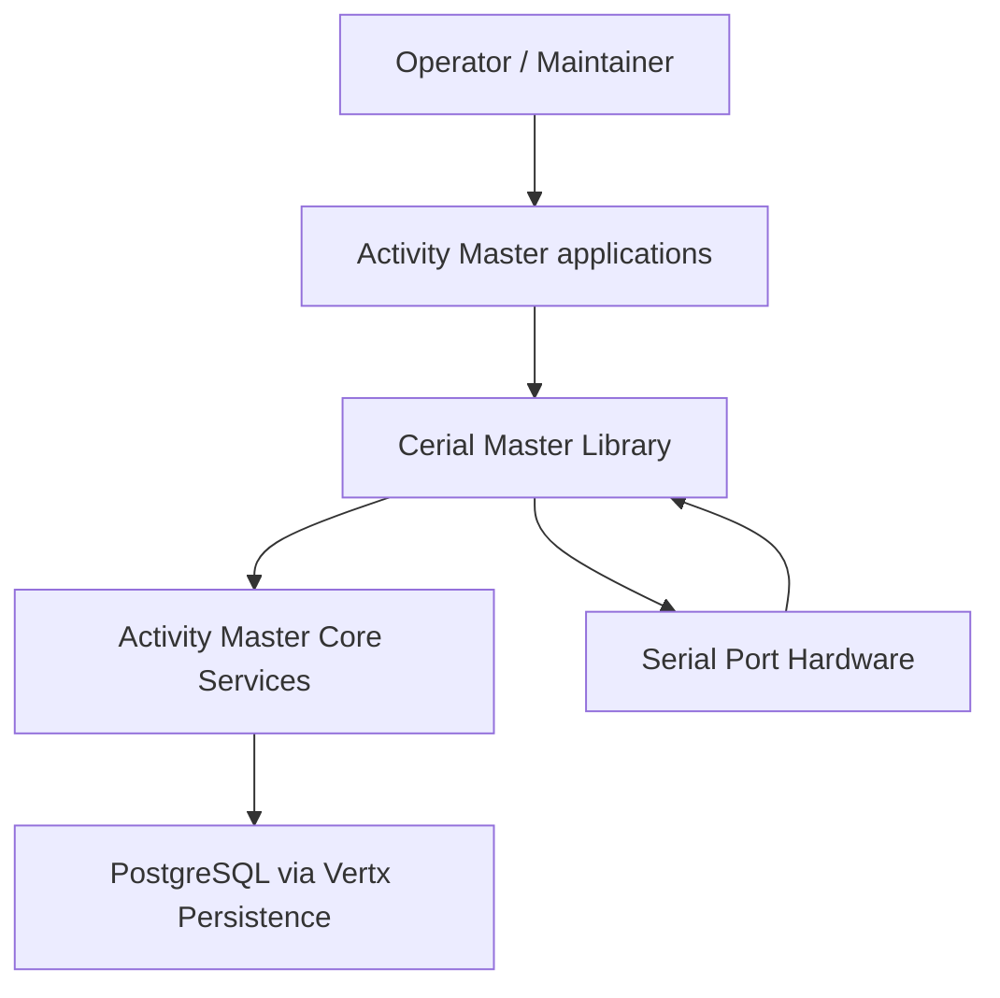

# C4 Level 1 — Context (Cerial Master Library)

Scope
- Cerial Master is a service/framework addon that registers serial ports as Activity Master resource items/classifications and manages COM port lifecycle.
- It integrates GuicedEE modules, Mutiny/Hibernate Reactive sessions, and jSerialComm/nrjavaserial for hardware access.
