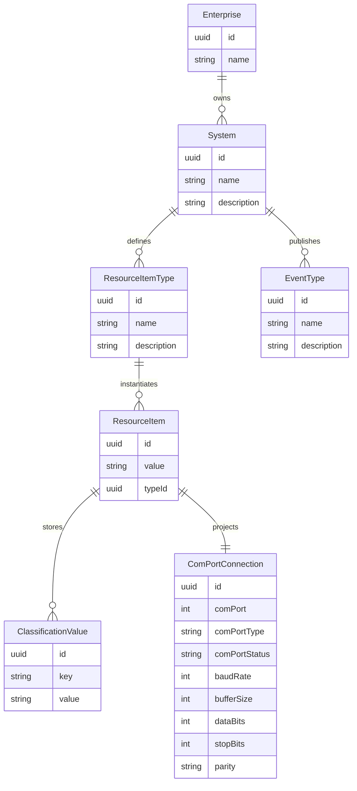

# ERD — Serial Connection Model (Activity Master Cerial)

Mapping to rules
- Classification keys and resource item types: see topic enums (ComPort, ComPortNumber, ComPortDeviceType, ComPortStatus, BaudRate, BufferSize, DataBits, StopBits, Parity, ComPortAllowedCharacters, ComPortEndOfMessage, SerialConnectionPort).
- Event types: RegisteredANewConnection, ClosedANewConnection, SendMessageToComPort, Message, MessageReceivedFromComPort.
- Projection: `ComPortConnection` domain object maps classification values to runtime port configuration.
