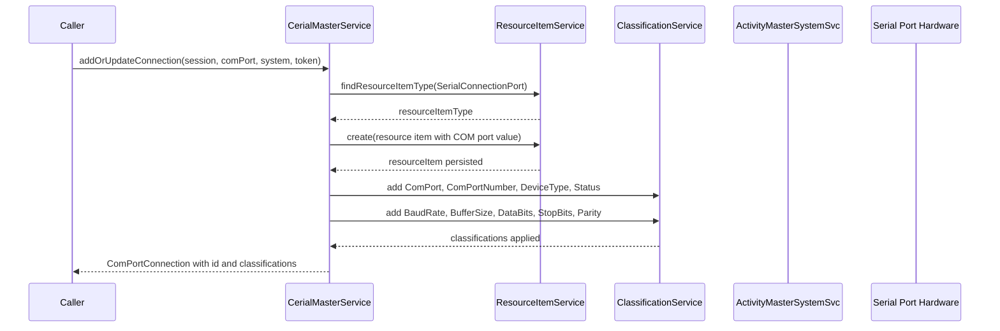

# Sequence — Add or Update COM Port

Notes
- Mutiny session provided by caller; no internal session creation.
- Hardware identity originates from `ComPortConnection` supplied by caller (built from jSerialComm scan).
