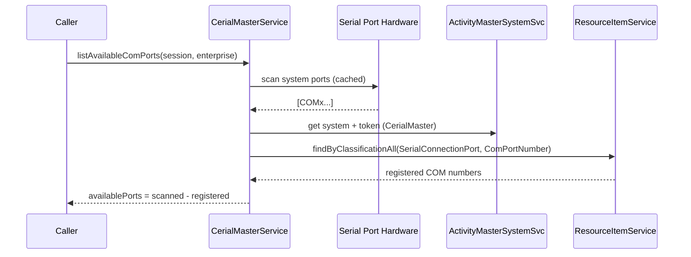

# Sequence — List Available COM Ports

Notes
- OS scan cached per process; refresh requires restart or explicit cache clearing.
- Registered ports derive from Activity Master resource items with `SerialConnectionPort` type and `ComPortNumber` classification.
