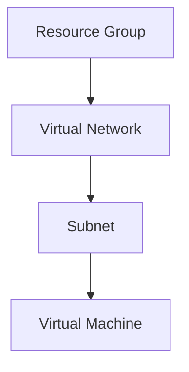

# terraform-doc-generator: Content

Read this reference when working on the topics below. Commands run from the skill directory.

- [Parsing Terraform Files](#parsing-terraform-files)
- [Documentation Patterns](#documentation-patterns)
- [Advanced README Features](#advanced-readme-features)

## Parsing Terraform Files

### Extract Variables

From `variables.tf`:
```hcl
variable "name" {
  description = "Name of the resource"
  type        = string
  default     = "example"
}

variable "environment" {
  description = "Environment name (dev, staging, prod)"
  type        = string

  validation {
    condition     = contains(["dev", "staging", "prod"], var.environment)
    error_message = "Must be dev, staging, or prod."
  }
}
```

**Parsed Output**:
| Name | Description | Type | Default | Required |
|------|-------------|------|---------|:--------:|
| name | Name of the resource | string | "example" | no |
| environment | Environment name (dev, staging, prod) | string | n/a | yes |

### Extract Outputs

From `outputs.tf`:
```hcl
output "id" {
  description = "ID of the resource"
  value       = azurerm_resource_group.main.id
}

output "name" {
  description = "Name of the resource"
  value       = azurerm_resource_group.main.name
}
```

**Parsed Output**:
| Name | Description |
|------|-------------|
| id | ID of the resource |
| name | Name of the resource |

### Extract Resources

From `main.tf`:
```hcl
resource "azurerm_resource_group" "main" {
  name     = var.name
  location = var.location
}

data "azurerm_client_config" "current" {}
```

**Parsed Output**:
| Name | Type |
|------|------|
| azurerm_resource_group.main | resource |
| azurerm_client_config.current | data source |

### Extract Provider Requirements

From `versions.tf` or `terraform.tf`:
```hcl
terraform {
  required_version = ">= 1.6"

  required_providers {
    azurerm = {
      source  = "hashicorp/azurerm"
      version = "~> 3.0"
    }
  }
}
```

**Parsed Output**:
- Terraform: >= 1.6
- Provider azurerm: ~> 3.0

## Documentation Patterns

### Pattern 1: Simple Module

**Files**:
- `main.tf` - Single resource
- `variables.tf` - Few variables
- `outputs.tf` - Basic outputs

**README**:
- Brief description
- Single usage example
- Basic tables

### Pattern 2: Complex Module

**Files**:
- `main.tf` - Multiple resources
- `variables.tf` - Many variables with validation
- `outputs.tf` - Multiple outputs
- `examples/` - Multiple examples

**README**:
- Detailed description
- Multiple usage examples
- Comprehensive tables
- Architecture diagrams
- Troubleshooting section

### Pattern 3: Nested Module

**Structure**:
```
modules/
├── compute/
│   ├── main.tf
│   └── README.md
├── network/
│   ├── main.tf
│   └── README.md
└── storage/
    ├── main.tf
    └── README.md
```

**README**:
- Root README with overview
- Module README for each submodule
- Integration examples

## Advanced README Features

### Add Badges

```markdown
# Terraform Module: {name}

[](https://www.terraform.io)
[](LICENSE)
```

### Add Diagrams

````markdown
## Architecture


\`\`\`
````

### Add Usage Notes

```markdown
## Usage Notes

- This module creates resources in Azure
- Requires contributor access to subscription
- Uses managed identity for authentication
- Supports all Azure regions
```

### Add Migration Guides

````markdown
## Migration from v1.x to v2.x

### Breaking Changes

- Variable `subnet_id` renamed to `subnet_ids` (now accepts list)
- Output `vnet_id` replaced with `network`

### Migration Steps

1. Update variable references:
   ```hcl
   # Before
   subnet_id = azurerm_subnet.main.id

   # After
   subnet_ids = [azurerm_subnet.main.id]
   ```

2. Update output references:
   ```hcl
   # Before
   vnet_id = module.network.vnet_id

   # After
   vnet_id = module.network.network.id
   ```
````

